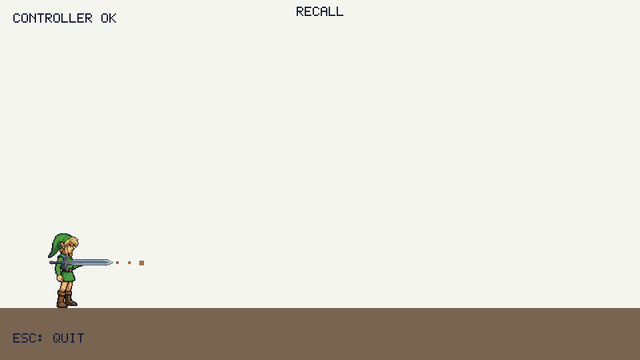

# Zelda-sandbox

A 2D sandbox for the mechanics of *Tears of the Kingdom* and *Breath of the Wild*, built in C++ and SDL2 (no engine, no physics library). I want to build almost all of the mechanics in those two games, as many as I have time for. It is the second project after [Zelda-Link.cpp](https://github.com/Trojanhammer/Zelda-Link.cpp), and a way to keep learning C++ and game physics.

**How it is organised:** every mechanic is built first in its own small sandbox, on its own, so I can understand it, test it and get it right before anything else gets in the way. Once each one works well, I will consider merging them into one world.



*Recall, the first mechanic: the left stick aims, X throws, O recalls (recorded from the game itself, played by a scripted virtual gamepad).*

> **How this was built (AI use):** the mechanics and the physics (`Weapon`, `Player`, the throw, gravity, landing, friction, and the recall to come) are written by me, by hand: I discuss an idea with Claude, write it myself until I understand it, and ask Claude to review it. The exceptions, written with AI to move faster: the SDL2 window and drawing helpers (`src/graphics/`, `src/ui/`, which draws text with a built-in pixel font) and the build script.

> **Disclaimer:** This is an unofficial fan project with no affiliation to Nintendo. *The Legend of Zelda* and its characters belong to Nintendo; this is built purely for personal learning and hobby purposes, with no plan to release or distribute it.

## Mechanics

| Mechanic | Status |
|---|---|
| Recall: throw a sword, then call it back along the way it came | in progress: the throw is done (gravity, landing, sliding to a stop); the recall is next |
| Updraft: fire heats the air above it and lifts things up | planned (the player has to be able to walk for this one) |
| Magnesis: move a metal object with the stick | planned |

These three come first, each in its own sandbox. After that, more mechanics from the two games as time allows.

## Build and run

```bash
./build.sh && ./sandbox
```

Needs SDL2 (`brew install sdl2`). Esc quits.

## Files

| File | Purpose |
|---|---|
| `src/main.cpp` | Window, loop, input |
| `src/Weapon.h/.cpp` | The sword: position, speed, state (held, thrown, idle, recall) |
| `src/Player.h/.cpp` | The player holds the sword and throws it; the physics of the throw |
| `src/graphics/` | Drawing only: ground, hand, a sword that turns, a dotted aim line, a marker, and loading / drawing / turning sprites |
| `docs/` | The GIF and the screenshot shown above |
| `assets/` | `link.png` (Link without a weapon) and `master-sword.png`, pixel art generated with AI and cleaned up (background removed, shrunk, 24 colors) |
| `src/input/` | Gamepad: the left stick aims (as a throw angle), X throws, O recalls |
| `src/ui/` | Text drawn with a small built-in 5x7 pixel font (no SDL_ttf) |
